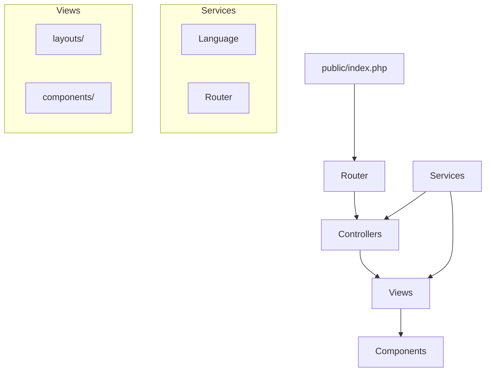

# Jules Vialas - Portfolio

> Site web personnel et portfolio de Jules Vialas, développeur informatique

## 🚀 Aperçu

Portfolio personnel développé en PHP vanilla avec une architecture MVC simple et moderne. Le site présente mon profil professionnel, mes compétences et mes projets avec un système multilingue français/anglais.

## ✨ Fonctionnalités

- **🌍 Multilingue** : Support français/anglais avec changement en temps réel
- **📱 Responsive** : Interface adaptative pour tous les appareils
- **⚡ Performance** : Code optimisé et structure légère
- **🔧 MVC** : Architecture claire et maintenable
- **🎨 Modern UI** : Design moderne avec animations fluides

## �️ Technologies

- **Backend** : PHP 8.1+ (vanilla)
- **Frontend** : HTML5, CSS3, JavaScript ES6+
- **Architecture** : MVC personnalisé
- **Styles** : CSS Variables, Flexbox, Grid
- **Icons** : Ionicons
- **Fonts** : Google Fonts (Poppins)

## 📁 Structure du projet

```
vialasjules.com/
├── public/
│   ├── index.php          # Point d'entrée
│   └── assets/
│       ├── css/style.css  # Styles principaux
│       ├── js/script.js   # JavaScript
│       └── images/        # Images et médias
└── src/
    ├── Autoloader.php     # Autoloader PSR-4
    ├── Controllers/       # Contrôleurs
    ├── Services/          # Services (Router, Language)
    └── Views/             # Vues et templates
```

## 🚀 Installation

1. **Cloner le projet**
   ```bash
   git clone https://github.com/JulesVialas/vialasjules.com.git
   cd vialasjules.com
   ```

2. **Serveur local**
   ```bash
   # Avec PHP intégré
   php -S localhost:8000 -t public/
   
   # Ou avec un serveur web (Apache/Nginx)
   # Pointez le document root vers le dossier 'public/'
   ```

3. **Accéder au site**
   ```
   http://localhost:8000
   ```

## ⚙️ Configuration

### Serveur Web

- **Document Root** : `/public`
- **PHP Version** : 8.1+
- **Extensions requises** : Aucune dépendance externe

### Variables d'environnement

Le projet fonctionne sans configuration supplémentaire. Les langues sont gérées automatiquement via :
- Paramètre URL : `?lang=fr` ou `?lang=en`
- Session PHP
- Cookie persistant

## 📝 Utilisation

### Changement de langue
```javascript
// Via JavaScript
window.location.href = '?lang=en';

// Via URL directe
https://votre-domain.com/?lang=fr
```

### Ajout de nouvelles traductions
Modifier le fichier `src/Services/Language.php` :
```php
'nouvelle.cle' => 'Nouvelle traduction',
```

## 🔧 Développement

### Standards de code
- **PHP** : PSR-4 (Autoloading), PSR-12 (Coding Style)
- **JavaScript** : ES6+, Modern practices
- **CSS** : BEM-like methodology, CSS Variables

### Architecture
- **Autoloader personnalisé** : PSR-4 compatible
- **Router simple** : Support GET/POST avec paramètres
- **Services** : Langage, routing
- **Contrôleurs** : Logique de présentation
- **Vues** : Templates PHP simples

## 📱 Responsive Design

- **Mobile First** : Design optimisé mobile
- **Breakpoints** :
  - Mobile : < 580px
  - Tablet : 580px - 768px
  - Desktop : > 768px

## 🎨 Personnalisation

### Couleurs
Modifier les variables CSS dans `public/assets/css/style.css` :
```css
:root {
  --accent-color: hsl(210, 100%, 45%);
  --background-light: hsl(0, 0%, 95%);
  /* ... */
}
```

### Contenu
- **Traductions** : `src/Services/Language.php`
- **Images** : `public/assets/images/`
- **Template principal** : `src/Views/layouts/home.php`

## 📄 Licence

Ce projet est sous licence MIT. Voir le fichier [LICENSE](LICENSE) pour plus de détails.

## � Auteur

**Jules Vialas**
- Email : jules.vialas@gmail.com
- GitHub : [@JulesVialas](https://github.com/JulesVialas)
- Site web : [vialasjules.com](https://vialasjules.com)

---

💡 **Développé avec passion à Toulouse, France**
- Système de vues modulaire
- Service de traduction centralisé
- Code documenté avec PHPDoc

## 📁 Structure du projet

```
vialasjules.com/
├── public/                     # Point d'entrée web
│   ├── index.php              # Bootstrap de l'application
│   ├── .htaccess              # Configuration Apache
│   └── assets/                # Ressources publiques
│       ├── css/
│       │   └── style.css      # Styles personnalisés
│       ├── js/
│       │   └── app.js         # JavaScript personnalisé
│       └── images/
│           └── logo.ico       # Favicon
├── src/                       # Code source de l'application
│   ├── Controllers/           # Contrôleurs MVC
│   │   └── HomeController.php
│   ├── Services/              # Services métier
│   │   ├── Language.php       # Gestion multilingue
│   │   └── Router.php         # Routeur HTTP
│   └── Views/                 # Templates et vues
│       ├── components/        # Composants réutilisables
│       │   ├── header.php
│       │   └── footer.php
│       └── layouts/           # Templates de page
│           └── home.php
├── README.md                  # Documentation
└── .htaccess                  # Configuration serveur
```

## 🚀 Installation

### Prérequis

- **PHP 8.0+** avec extensions :
  - `session`
  - `json`
- **Serveur web** : Apache/Nginx
- **Git** pour le clonage

### Installation locale

1. **Cloner le repository**
   ```bash
   git clone https://github.com/JulesVialas/vialasjules.com.git
   cd vialasjules.com
   ```

2. **Configuration du serveur web**
   
   **Avec XAMPP/WAMP :**
   ```bash
   # Copier le projet dans le dossier web
   cp -r . /path/to/xampp/htdocs/vialasjules
   ```
   
   **Avec serveur PHP intégré :**
   ```bash
   # Démarrer depuis le dossier public/
   cd public
   php -S localhost:8000
   ```

3. **Configuration Apache** (optionnel)
   ```apache
   <VirtualHost *:80>
       DocumentRoot "/path/to/vialasjules.com/public"
       ServerName vialasjules.local
       <Directory "/path/to/vialasjules.com/public">
           AllowOverride All
           Require all granted
       </Directory>
   </VirtualHost>
   ```

## ⚙️ Configuration

### Variables d'environnement

Le projet fonctionne sans configuration particulière. Les paramètres par défaut :

- **Langue par défaut** : Français (`fr`)
- **Langues supportées** : `fr`, `en`
- **Durée du cookie** : 30 jours
- **Point d'entrée** : `public/index.php`

### Personnalisation

**Ajouter une nouvelle langue :**
```php
// Dans src/Services/Language.php
private static function loadTranslations(): void {
    self::$translations = [
        'fr' => [...],
        'en' => [...],
        'es' => [  // Nouvelle langue
            'nav.home' => 'Inicio',
            // ...
        ]
    ];
}
```

**Ajouter une nouvelle route :**
```php
// Dans public/index.php
$router->get('/about', [new AboutController(), 'get']);
$router->get('/contact', [new ContactController(), 'get']);
```

## 🎮 Utilisation

### Accès au site
- **Local** : `http://localhost:8000` ou `http://vialasjules.local`
- **Production** : `https://vialasjules.com`

### Changement de langue
- Cliquer sur le drapeau dans la navigation
- URL directe : `?lang=en` ou `?lang=fr`
- La préférence est sauvegardée automatiquement

### Navigation
- **Accueil** : `/` - Page principale
- **À propos** : `/about` - Présentation détaillée
- **Contact** : `/contact` - Formulaire de contact

## 🏗️ Architecture

### Pattern MVC



### Flux de requête

1. **Point d'entrée** : `public/index.php`
2. **Initialisation** : Session, Language, Router
3. **Routage** : Analyse de l'URI et méthode HTTP
4. **Contrôleur** : Exécution de la logique métier
5. **Vue** : Rendu du template avec données
6. **Réponse** : HTML généré envoyé au navigateur

### Services principaux

- **Language** : Gestion multilingue et traductions
- **Router** : Routage HTTP avec paramètres dynamiques
- **Controllers** : Logique métier et coordination

## 🛠️ Technologies

### Backend
- **PHP 8.0+** - Langage principal
- **Architecture MVC** - Pattern de conception
- **PSR-4** - Autoloading et namespaces
- **PHPDoc** - Documentation du code

### Frontend
- **Bootstrap 5.3.8** - Framework CSS
- **HTML5 sémantique** - Structure
- **JavaScript vanilla** - Interactions
- **CSS3** - Styles personnalisés

### Outils et standards
- **Git** - Versioning
- **Apache/Nginx** - Serveur web
- **Responsive design** - Adaptabilité mobile
- **SEO optimized** - Référencement

## 🚢 Déploiement

### Déploiement automatique

**Via Git :**
```bash
# Sur le serveur de production
git clone https://github.com/JulesVialas/vialasjules.com.git
cd vialasjules.com

# Configuration du virtual host vers public/
# Redémarrage du serveur web
```

**Via FTP :**
```bash
# Upload de tous les fichiers
# Configuration du document root vers public/
```

### Configuration production

1. **Document Root** : Pointer vers `public/`
2. **PHP** : Version 8.0+ recommandée
3. **Apache modules** : `mod_rewrite` activé
4. **Permissions** : 755 pour dossiers, 644 pour fichiers

### Optimisations production

- **Minification** : CSS/JS si nécessaire
- **Cache** : Headers HTTP appropriés
- **Compression** : Gzip activé
- **HTTPS** : Certificat SSL configuré

## 🤝 Contribution

### Développement

1. **Fork** du repository
2. **Créer une branche** : `git checkout -b feature/nouvelle-fonctionnalite`
3. **Développer** avec tests
4. **Commit** : `git commit -m "feat: description de la fonctionnalité"`
5. **Push** : `git push origin feature/nouvelle-fonctionnalite`
6. **Pull Request** avec description détaillée

### Standards de code

- **PSR-4** : Autoloading
- **PSR-12** : Style de code
- **PHPDoc** : Documentation obligatoire
- **Tests** : Couverture recommandée

### Issues et bugs

Utiliser les [GitHub Issues](https://github.com/JulesVialas/vialasjules.com/issues) pour :
- 🐛 Signaler des bugs
- 💡 Proposer des améliorations
- 📖 Demander de la documentation

## 📄 Licence

Ce projet est sous licence **MIT**. Voir le fichier [LICENSE](LICENSE) pour plus de détails.

---

## 👨‍💻 Auteur

**Jules Vialas**
- 🌐 Website : [vialasjules.com](https://vialasjules.com)
- 💼 LinkedIn : [julesvialas](https://linkedin.com/in/julesvialas)
- 🐱 GitHub : [JulesVialas](https://github.com/JulesVialas)

---

<div align="center">
  <p>Développé avec ❤️ par Jules Vialas</p>
  <p><small>Dernière mise à jour : Septembre 2025</small></p>
</div>